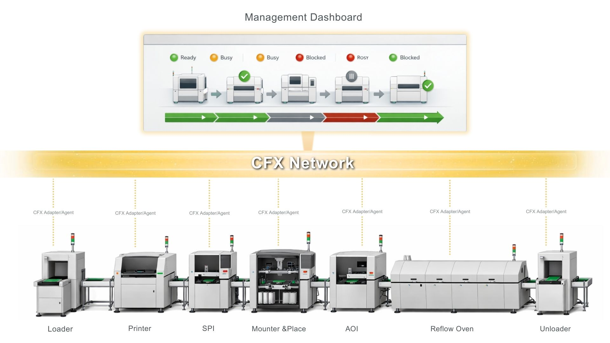
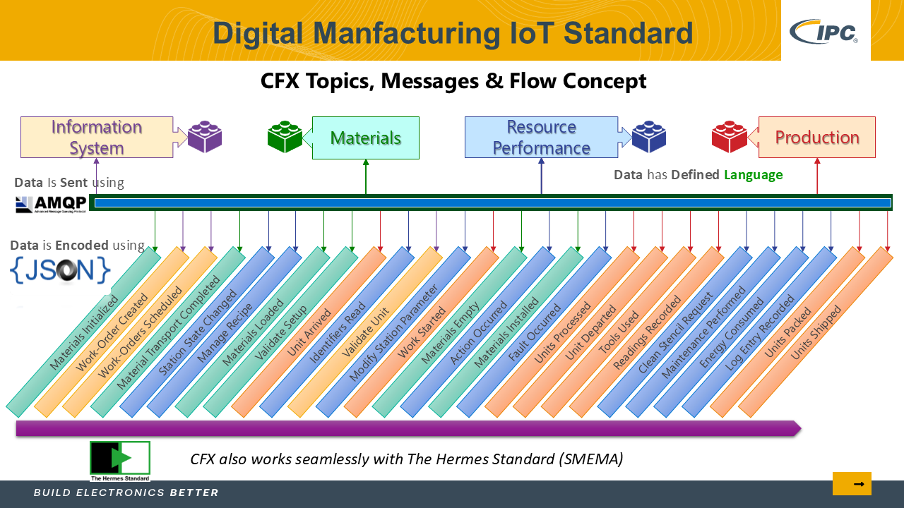
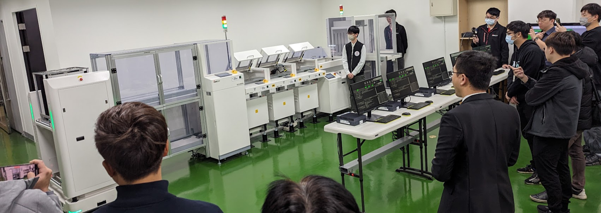

# Containerized IPC-CFX Manufacturing Data Exchange

Plug-and-play edge connectivity for SMT production lines, enabling real-time data harmonization, end-to-end traceability, and smart factory integration.

## Overview

The Containerized IPC-CFX Manufacturing Data Exchange is a robust, edge-ready middleware solution designed to eliminate information silos on the shop floor. By deploying this lightweight container directly onto Advantech Edge IPCs, manufacturers can instantly leverage the global IPC-CFX (Connected Factory Exchange) standard.

Utilizing the open AMQP v1.0 messaging protocol and structured JSON data encoding, this solution translates fragmented, proprietary machine schemas into a single, unified data language. It provides seamless, bi-directional integration between your SMT equipment (AOI, SPI, Printers, Reflow, Mounters) and enterprise MES/ERP/Digital Twin platforms, creating a transparent, efficient, and fully traceable manufacturing environment.

## The Challenge: Breaking Down Data Silos & Enabling a Unified Data Schema for Electronics Manufacturing

While modern SMT production lines feature highly automated equipment, the data they generate remains deeply fragmented. Traditional integration suffers from:
- Proprietary Schemas: Each vendor utilizes unique data structures, preventing cross-machine communication.
- High Integration Costs: Point-to-point custom API developments drive up deployment time and maintenance overhead.
- Delayed Intelligence: Lack of real-time data restricts factory-wide visibility, stalling the realization of closed-loop, AI-driven smart manufacturing.

## Solution Value & ROI

### Smoother Manufacturing Data Integration Value with CFX
Deploying the IPC-CFX container fundamentally transforms edge-to-cloud data workflows, delivering proven business outcomes:
- **66% Automation Improvement:** Automated exchange of process and equipment data drastically reduces manual intervention and human error.
- **25% - 35% Throughput Increase:** Real-time manufacturing data enables dynamic line balancing and optimized OEE (Overall Equipment Effectiveness).
- **Sub-3-Minute Changeovers:** Centralized, automated recipe management and reporting minimize operational downtime during product shifts.
- **Board-Level Traceability:** Deep integration with IPC-Hermes-9852 allows continuous tracking of PCB serial numbers, batch data, and routing.
- **Real-time data visibility & digital twin readiness:** Production output, equipment status, and alarms are reported live to MES and shared with digital twins for optimizing production processes.
- **Unified equipment integration:** A common data language enables seamless integration of AOI, SPI, Printer, Reflow, Mounter, AMRs and all supporting equipment.

[]

## Container Demo

## Data Coverage

## What Manufacturing Data CFX Can Exchange

Provides the key manufacturing data required for real-time visibility, process transparency, and end-to-end traceability.
- **Equipment status and events:** operating states, alarms, downtime, and maintenance events
- **Process and production data:** throughput, cycle time, production counts, and process parameters
- **Quality and inspection data:** AOI, SPI, and test results
- **Material and traceability data:** part numbers, batch information, and material usage records
- **Operational performance data:** foundational data supporting utilization, yield, and OEE analysis
- **Digital twin simulation:** live equipment configuration and telemetry for simulating and adjusting your production line in digital twins

# Data Exchange Flow

## CFX Data Exchange Flow Diagram

## CFX Data Structure

# Support & Inquiries
- Demo Request: Schedule a live demonstration with our demo line. [Contact Us](https://www.sunjsong.com/en/contact/)
- Proof of Concept Pilot: Evaluate adopting CFX for your SMT productions

